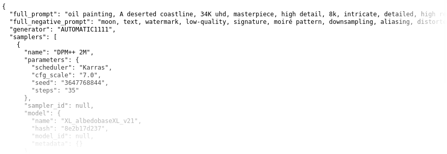

# SD-Parsers
Read structured metadata from images created with stable diffusion.



> [!Caution]
> You are currently reading the documentation for the master branch!
> 
> Go [here](https://github.com/d3x-at/sd-parsers/tree/v0.5) for the documentation of the latest release.

## Features

Prompts as well as some well-known generation parameters are provided as easily accessible properties (see [Output](#output)).

Supports reading metadata from images generated with:
* Automatic1111's Stable Diffusion web UI
* ComfyUI *
* Fooocus
* InvokeAI
* NovelAI

\* Custom ComfyUI nodes might parse incorrectly / with incomplete data.

## Installation
```
pip install sd-parsers
```

## Usage

From command line: ```python3 -m sd_parsers <filenames>```.


### Basic usage:

For a simple query, import ```ParserManager``` from ```sd_parsers``` and use its ```parse()``` method to parse an image. (see [examples](examples))

#### Read prompt information from a given filename with `parse()`:
```python
from sd_parsers import ParserManager

parser_manager = ParserManager()

def main():
    prompt_info = parser_manager.parse("image.png")

    if prompt_info:
        for prompt in prompt_info.prompts:
            print(f"Prompt: {prompt.value}")
```

#### Read prompt information from an already opened image:
```python
from PIL import Image
from sd_parsers import ParserManager

parser_manager = ParserManager()

def main():
    with Image.open('image.png') as image:
        prompt_info = parser_manager.parse(image)
```

#### Only use a specific parser module (or add a custom one):

```python
from sd_parsers import ParserManager
from sd_parsers.parsers import MANAGED_PARSERS, AUTOMATIC1111Parser

# remove all preset parser modules
MANAGED_PARSERS.clear()

# add the AUTOMATIC1111 parser as only parser module
MANAGED_PARSERS.extend([AUTOMATIC1111Parser])

parser_manager = ParserManager()
```

#### Only use a specific metadata extractor (or add a custom one):

```python
from sd_parsers import ParserManager
from sd_parsers.extractors import METADATA_EXTRACTORS, Eagerness

# remove all preset PNG extractors for the first (FAST) stage
METADATA_EXTRACTORS["PNG"][Eagerness.FAST].clear()

# add a custom extractor
METADATA_EXTRACTORS["PNG"][Eagerness.FAST].append(
    lambda i, g: {"parameters": "custom extracted data\nSampler: UniPC, Steps: 15, CFG scale: 5"}
)

parser_manager = ParserManager()
```

### Output
The `parse()` method returns a `PromptInfo` ([source](src/sd_parsers/data/prompt_info.py)) object when suitable metadata is found.

> Use ```python3 -m sd_parsers <image.png>``` to get an idea of the data parsed from an image file.

> To get a result in JSON form, an approach as demonstrated in https://github.com/d3x-at/sd-parsers-web can be used.

`PromptInfo` contains the following properties :
* `generator`: Specifies the image [generator](src/sd_parsers/data/generators.py) that may have been used for creating the image.

* `full_prompt`: A full prompt, if present in the image metadata.

  Otherwise, a simple concatenation of all prompts found.

* `full_negative_prompt`: A full negative prompt if present in the image metadata. 
  
  Otherwise, a simple concatenation of all negative prompts found.

* `prompts`: All [prompts](src/sd_parsers/data/prompt.py) found in the parsed metadata.

* `negative_prompts`: All negative [prompts](src/sd_parsers/data/prompt.py) found in the parsed metadata.

* `models`: [Models](src/sd_parsers/data/model.py) used in the image generation process.

* `samplers`: [Samplers](src/sd_parsers/data/sampler.py) used in the image generation process.

  A Sampler contains the following properties specific to itself:
    * `name`: The name of the sampler

    * `parameters`: Generation parameters, including _cfg_scale_, _seed_, _steps_ and others.

    * `sampler_id`: A unique id of the sampler (if present in the metadata)

    * `model`: The model used by this sampler.

    * `prompts`: A list of positive prompts used by this sampler.
    
    * `negative_prompts`: A list of negative prompts used by this sampler.

* `metadata`: Additional metadata which could not be attributed to one of the former described.

  Highly dependent on the provided data structure of the respective image generator.

* `raw_parameters`: The unprocessed metadata entries as found in the parsed image (if present).

## Contributing
As i don't have the time and resources to keep up with all the available AI-based image generators out there, the scale and features of this library is depending greatly on your help.

If you find the sd-parsers library unable to read metadata from an image, feel free to open an [issue](https://github.com/d3x-at/sd-parsers/issues).

See [CONTRIBUTING.md](https://github.com/d3x-at/sd-parsers/blob/master/.github/CONTRIBUTING.md), if you are willing to help with improving the library itself and/or to create/maintain an additional parser module.


## Credits
Idea and motivation using AUTOMATIC1111's stable diffusion webui
- https://github.com/AUTOMATIC1111/stable-diffusion-webui

Example workflows for testing the ComfyUI parser
- https://github.com/comfyanonymous/ComfyUI_examples
